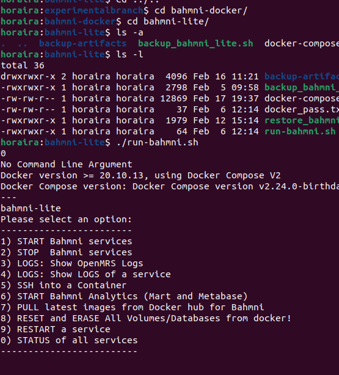

# Bahmni Docker

Refer this [Wiki Page](https://bahmni.atlassian.net/wiki/spaces/BAH/pages/299630726/Running+Bahmni+on+Docker) or below summary Bhamni-lite local deployement for Running Bahmni on Docker for detailed instructions.

# To start Bahmni LITE or STANDARD using docker compose: 
1. Go to bahmni-lite or bahmni-standard subfolder. For example: `cd bahmni-lite`.
2. Execute script: `./run-bahmni.sh`. This will give you options for start/stop/view-logs/pull/reset/etc. 
3. Ensure your `.env` file in the sub-folder has correct PROFILE configured, before executing the above commands.  

# Bahmni-lite local deployment
**Bahmni Lite** is a light-weight, opensource flavor of Bahmni targeted towards clinics & small hospitals, which don’t need a heavy-weight HIMS, but are looking for an easy-to-use EMR & Billing software. See [Release Notes](https://bahmni.atlassian.net/wiki/spaces/BAH/pages/20185103 "/wiki/spaces/BAH/pages/20185103").

Currently Bahmni-lite dockerized version is also used for development as well (May be further exploration is needed to have a right developer setup/envoirnment)

## Runing Bahmni-lite
### Bahmni-lite on codespace

**If you are just starting**, or want to just explore, you can start with [gitHub Codespaces](https://github.com/features/codespaces)
Please watch this half an hour video to run Bahmni Lite in gitHub Codespaces 
https://www.youtube.com/watch?v=ufbf7YWcrgY&t=1202s

### Running Bahmni-lite on local system
**Steps to be followed:** 

1. Please check if you have docker with docker compose version >= **`2.12.0`** on your system installed
	`docker compose version # type from command prompt to check docker-compose version`

    > [!info] 
    > You can install Docker from [here](https://docs.docker.com/engine/install/ "https://docs.docker.com/engine/install/"). Choose the appropriate installers for your host machine and follow the instructions mentioned for the host platform.  **MacOS:** You can get the dmg file for Docker [here](https://store.docker.com/editions/community/docker-ce-desktop-mac "https://store.docker.com/editions/community/docker-ce-desktop-mac").

2. Please clone bahmni-docker from 
https://github.com/Bahmni/bahmni-docker or Digiind repository which has forked one 

**`git clone https://github.com/Bahmni/bahmni-docker.git ` **

Or Digiind one 

**`git clone https://github.com/DIGIIND-Healthcare/bahmni-docker.git ` **

Only above two things are needed to run Bahmni-lite locally
Bahmni-docker repository contains [.env](https://github.com/Bahmni/bahmni-docker/blob/1.0.0-lite/bahmni-lite/.env) file which contains the dependent docker images and the [docker-compose.yml](https://github.com/Bahmni/bahmni-docker/blob/1.0.0-lite/bahmni-lite/docker-compose.yml) which contains needed instruction to pull the images and run it. 

Once cloned you can enter into bahmni-docker/bahmni-lite folder

**`cd bahmni-docker/bahmni-lite`**

**We are using tag 1.0.0-lite**
So you can checkout tag 1.0.0-lite orif you have cloned from Digiind then this branch, which is branched out from 1.0.0-lite or if you want to try out on current master then you can skip checking out tag or digiind branch 

**`git checkout 1.0.0-lite`**

or

**`git checkout experimental/branched-from-1.0.0-lite `**

Below steps can be optional on first try but if you are comfortable then you can try, basically it is making some changes in .env and docker-compose.yml 

> Edit the .env file, and make the following changes to set bahmni-lite profile
> 1. Change **`COMPOSE_PROFILES=bahmni-lite`** (or run with default which is **`emr`**)
> 2. (Optional) Change `TZ` to your desired timezone (or run with the default which is `UTC`). 
> 3. (Optional) For remote server (if not running on localhost) for crater: # write the IP address or domain name in the following properties (instead of localhost): CRATER_APP_URL, CRATER_SANCTUM_STATEFUL_DOMAINS and CRATER_SESSION_DOMAIN 
> 4. Pull latest images docker compose pull 
>  5. Now start docker (detached mode) docker compose up -d Or from bahmni-docker/bahmni-lite directory issue the command ./run-bahmni.sh and follow the instruction provided

You can issue different command like running /stopping by running run_bahmni.sh script present in bahmni-docker/bahmni-lite folder

**`./run_bahmni.sh`**

> [!info] 
> you can start bahmni app by opening localhost in browser, please not that openMRS takes some minutes to get initialized , so till it's initialized front page can open but it would not proceed as underlying database etc is not being initialised 

> [!info] 
> - **Bahmni UI** (Username: `superman` Password: `Admin123`) : [https://localhost/bahmni/home/index.html](https://localhost/bahmni/home/index.html "https://localhost/bahmni/home/index.html")
> - **OpenMRS Admin UI** (Username: `superman` Password: `Admin123`) : [https://localhost/openmrs](https://localhost/openmrs "https://localhost/openmrs")
> - **Crater Billing** (Username: `superman@bahmni.org` Password: `Crater123`): [https://localhost:444/](http://localhost:81/ "http://localhost:81/")
> - **Metabase Analytics** (Username: `admin@mybahmni.org` Password: `Admin@123`): [https://localhost/metabase](https://localhost/metabase "https://localhost/metabase")/

#### Getting Started Quickly with Bahmni on Docker
https://bahmni.atlassian.net/wiki/spaces/BAH/pages/3117744129/Getting+Started+Quickly+with+Bahmni+on+Docker#Running-Bahmni-Lite

## Updating/customising Bahmni-lite
It seems (based on current exploration) we have to use this docker way also to modifying/updating code/configuration etc.
Idea is to clone the needed repo, here as example below two repos we are using fo white-labelling and other customisation

In bahmni documents they have mentioned to provide local config volume path to bahmni-docker .env value, for example if we want to make changes in clinic-config and locally wants to see, for that we need to follow below step
### working with clinic-config volume
1. Please clone clinic-config repo https://github.com/Bahmni/clinic-config
	1. `git clone https://github.com/Bahmni/clinic-config.git`
	2. `cd clinic-config`
2.  If we are using tag 1.0.0-lite for bahmni-docker then here also we can checkout 1.0.0 tag
	1. `git checkout 1.0.0`
3. Now we need to update bahmni-docker/bahmni-lite/.env and docker-compose.yml to take this local clinic-config settings instead of from docker image downloaded
	1. Update the `CONFIG_VOLUME` varaible in `bahmni-docker/bahmni-lite/.env` 
		`CONFIG_VOLUME=/home/horaira/workspace/indiclinic/bahmnicommitcomp/experimentalbranch/clinic-config`
		for me i have provided actual path where clinic-config is present
	1. Now we need to comment `bahmni-config` service in `bahmni-docker/bahmni-lite/docker-compose.yml`
![[Pasted image 20240219172904.png]]

![[Pasted image 20240219172928.png]]

After thes we can start either using command  docker-compose up -d or by invoking ./run_bahmni.sh

> [!info] 
> Once it's running , i see that , if you are making any changes , such as in whiteLable.json, it immediately reflects after refresh, but i think some some contents are being used only at the time of initialization in that case the dependent services needs to be restarted, so that it should reflect.

### Working with  openmrs-module-bahmniapps
openmrs-module-bahmniapps also has to be done in same way as clinic-config , but here at it's java module we need to build after making changes
> [!info]
> openmrs-module-bahmniapps repository contains most of the **frontend** code for the **Bahmni EMR**. It is written in **AngularJS** with only the Form viewer part utilising **_React_**.

1. This repository contains most of the **frontend** code for the **Bahmni EMR**. It is written in **AngularJS** with only the Form viewer part utilising **_React_**.
2. See the sub-folder: **`ui/app/`** to understand which all modules of the EMR UI are contained in this codebase.
3. Regarding the decision of migrating away from AngularJS and instead use React, please read this blog writeup: [Bahmni EMR - 1 M lines of code](https://medium.com/bahmni-blog/bahmni-emr-1million-lines-of-open-source-code-87e610e9a4ec)
4. This code needs help in migrating to React. If you are interested in helping, please ping the Bahmni team on Slack (`#community` channel).
5. All Epics, Stories, Bugs, etc are tracked in [JIRA: Volunteer Board](https://bahmni.atlassian.net/secure/RapidBoard.jspa?rapidView=25&projectKey=BAH&quickFilter=66).
6. To Run Bahmni locally you should use Docker option of Bahmni or Vagrant option. Docker is recommended.

Here also we should use 1.0.0 tag and follow similar steps as we did for clinic-config
https://github.com/Bahmni/openmrs-module-bahmniapps

Reference wiki for below instructions
https://bahmni.atlassian.net/wiki/spaces/BAH/pages/3117449349/Bahmni-Web+Configurations+docker

`git clone https://github.com/Bahmni/openmrs-module-bahmniapps.git`

`cd openmrs-module-bahmniapps `

`git checkout 1.0.0`

We need to intall build dependencies, i found it little bit compilcated as it's using some older version of ruby and for me somehow ubuntu 22.04 was not supporting it.

#### One time installation:

These steps need to performed ONLY the FIRST TIME you set up this code.

1. Install node/npm (node version: 10.11.0). Preferably use nvm, so that you have control over which project uses which version of node. See:
    - [how to install Node using nvm](https://github.com/nvm-sh/nvm).
    - [how to install NodeJS on mac](https://www.newline.co/@Adele/how-to-install-nodejs-and-npm-on-macos--22782681).
2. Install Yarn: `npm install -g yarn`
3. Install Grunt: `npm install -g grunt-cli`
4. Install Compass:
    - Compass compiles SASS/SCSS into CSS.
    - Requires ruby (It's recommended to install ruby also using rvm. See install [rvm with ruby](https://stackify.com/rvm-how-to-get-started-and-manage-your-ruby-installations/)).
    - Ruby version: 2.6.6
    - Once ruby is installed, you can install compass using: `gem install compass`

#### Build commands

**NOTE:** Run these commands from within the `ui` sub-folder.

1. `yarn install`
2. `yarn ci` (will internally trigger grunt)
3. If build is successful, the `dist` folder has the set of files to be deployed in Apache (or in Vagrant).
#### Docker (Hot Deploy)

1. If you are using Bahmni Docker, then you can hot deploy your app by following these steps: [Bahmni Web Configurations Docker (Wiki)](https://bahmni.atlassian.net/wiki/spaces/BAH/pages/3117449349/Bahmni-Web+Configurations+docker)

### Configuration page

Bahmni wiki has detailed document for configurations, below is the link
https://bahmni.atlassian.net/wiki/spaces/BAH/pages/34013647/Configuration+101

> [!info]
> the Configuration 101 is set of confgurations done on bahmni-standard as well as bahmni-lite, as bahmni-lite is subset of bahmni-standard so there may be chances that a particular configuration doesn't apply to it as it might be not using that particular module or in bahmn-lite it might have been implemented in other way

![[Pasted image 20240219181041.png]]

